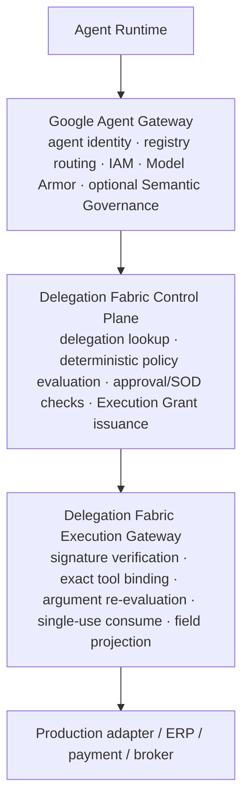
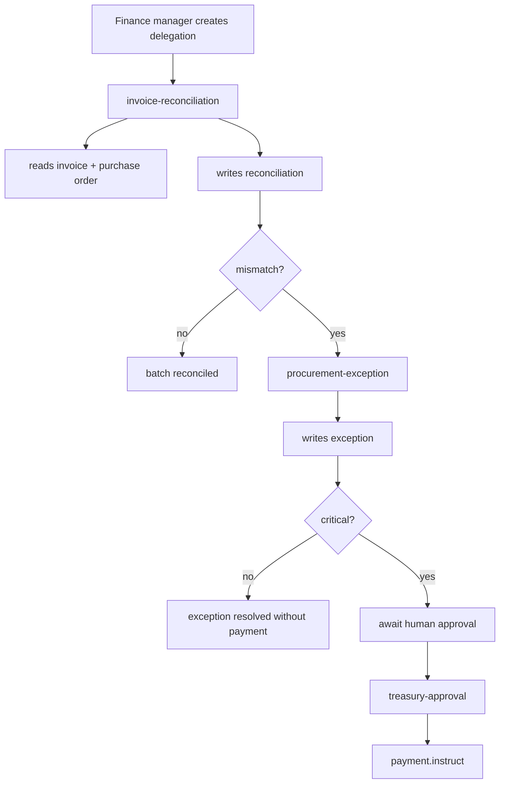
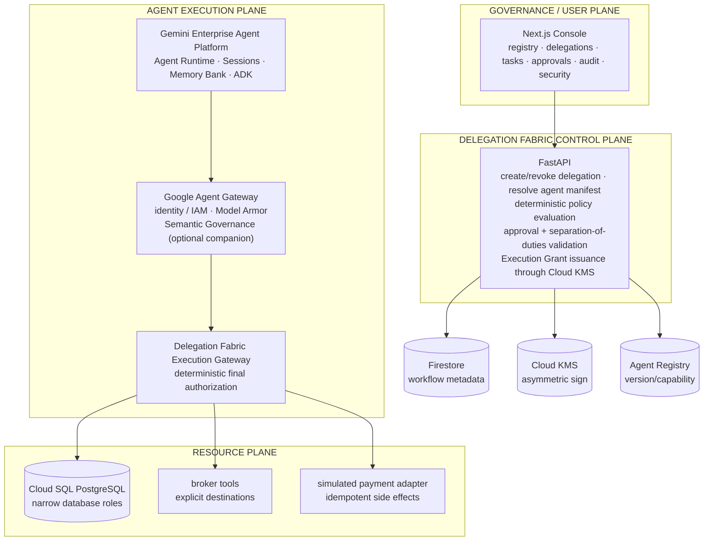
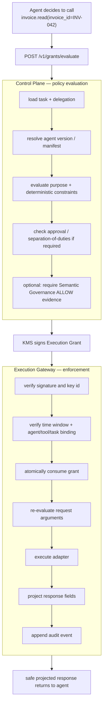
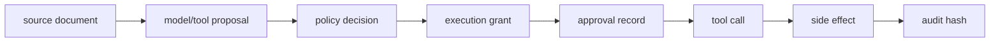

# Delegation Fabric

**Deterministic, purpose-bound transaction authorization for enterprise AI agent fleets.**

Delegation Fabric is an authorization and governance layer for enterprise AI agents that operate for hours, days, or weeks but must never inherit broad, permanent, human-equivalent production permissions.

The platform separates:

- **who delegated authority**,
- **why the work is allowed**,
- **which agent/version is acting**,
- **which exact tool is being invoked**,
- **which arguments are permitted**,
- **which response fields may return to the model**,
- **which approval is required**,
- **where the action may execute**,
- and **whether that authorization has already been consumed**.

Every protected side effect requires a short-lived, cryptographically signed, single-use **Execution Grant**. The grant is verified and transactionally consumed by the **Delegation Fabric Execution Gateway** before the underlying ERP, payment adapter, database mutation, email broker, or other production operation executes.

Submitted to the **All Things Agentic Hackathon — Track 3: The Fortified Enterprise Fleet**.

---

## 1. Project thesis

Enterprise agents should not receive standing authority simply because they are capable of calling a tool.

The important authorization question is not:

```text
Can this agent call payment.instruct()?
```

It is:

```text
Can treasury-approval@1.0.3,
acting under delegation dlg_01,
for sponsor priya@example.com,
for purpose weekly_vendor_settlement,
for task task_1001,
call payment.instruct(
    batch_id="PB-88",
    amount_minor=74200000,
    currency="INR"
),
in asia-south1,
using approval apr_44,
where apr_44 was created by a different authorized human,
and using a grant that is valid, unmodified, and not already consumed?
```

Delegation Fabric answers the second question immediately before the side effect.

The model can still make a bad decision. The authorization boundary makes that bad decision non-authoritative.

> The model may encounter the attack. The authorization system prevents the attack from becoming an unauthorized side effect.

---

## 2. What is new here

Google Agent Platform already provides managed runtime, Agent Registry, Agent Identity, Agent Gateway, Model Armor, and Semantic Governance. Delegation Fabric is deliberately **not** a replacement for those controls.

Delegation Fabric adds a deterministic transaction-authorization primitive that is useful even after semantic/tool-policy checks succeed:

1. **Human-anchored delegation chain**
2. **Purpose-bound authorization context**
3. **Deterministic argument constraints**
4. **Cryptographically signed Execution Grants**
5. **Single-use transactional consumption**
6. **Field-level response projection**
7. **Separation-of-duties checks**
8. **Explicit approval binding**
9. **Causal audit chain**
10. **Replay-safe long-running resumption**

Recommended enforcement sequence:



Semantic Governance is probabilistic and intent-oriented. Delegation Fabric's final authorization path is deterministic and credential-oriented.

---

## 3. Core terminology

| Term | Meaning |
| --- | --- |
| **Delegation Fabric** | The platform |
| **Delegation** | Long-lived, human-anchored authority for one business purpose/workflow |
| **Execution Grant** | Short-lived, single-use signed credential for one protected tool action |
| **Approval Record** | Human approval satisfying a policy requirement |
| **Agent Manifest** | Versioned declaration of capabilities, risk class, ownership, region and memory policy |
| **Control Plane** | Deterministic policy decision point and grant issuer |
| **Execution Gateway** | Delegation Fabric enforcement point immediately before tool execution |
| **Google Agent Gateway** | Google-managed identity/routing/semantic-policy gateway; distinct from the Execution Gateway |
| **Task Checkpoint** | Durable workflow state used to resume a long-running task |
| **Audit Event** | Structured provenance event in the tamper-evident audit chain |

---

## 4. Security invariants

These invariants must hold even if the model is manipulated.

1. Agents do not receive standing ERP/payment credentials.
2. Every protected tool call requires a valid Execution Grant.
3. A grant is bound to one `agent_id + agent_version + tool`.
4. A grant is bound to one task and delegation.
5. Arguments must satisfy deterministic constraints.
6. Critical grants bind to an explicit approval record when required.
7. Approval identity must satisfy separation-of-duties rules.
8. The Execution Gateway consumes a side-effecting grant before execution.
9. Replaying a consumed grant fails.
10. Tool responses are projected to allowed fields before returning to the model.
11. Agent-to-agent calls may preserve or reduce authority but never silently expand it.
12. Long waits never reuse stale grants; resumed tasks mint fresh grants.
13. Push-delivered Pub/Sub events are treated as at-least-once and are idempotently processed.
14. Audit data records decision provenance, not model chain-of-thought.
15. Database/IAM controls remain narrower than or equal to application-level authority.

---

## 5. Reference fleet

| Agent | Risk | Allowed | Explicitly denied |
| --- | --- | --- | --- |
| `invoice-reconciliation` | medium | invoice/PO reads, reconciliation write | payment instruction, bank-account reads |
| `procurement-exception` | high | mismatch investigation, vendor metadata, exception write | approving its own exception |
| `treasury-approval` | critical | payment-batch summary and approved payment instruction | payment without valid human approval |

### Main workflow



---

## 6. Architecture at a glance



Cross-cutting flows:

- Events: Pub/Sub → Cloud Run worker → checkpoint/resume
- Audit: Firestore chain → Cloud Storage retention bucket
- Telemetry: OpenTelemetry → Cloud Trace / Logging / Monitoring

---

## 7. Documentation map

The README is intentionally an entry point. Implementation contracts are broken out below.

| Document | Use it for |
| --- | --- |
| [`PLAN.md`](PLAN.md) | Day-by-day build order, critical path and definition of done |
| [`docs/ARCHITECTURE.md`](docs/ARCHITECTURE.md) | Trust boundaries, components, request flows and service responsibilities |
| [`docs/AUTHORIZATION.md`](docs/AUTHORIZATION.md) | Delegations, Execution Grants, constraints, policies, approvals and reason codes |
| [`docs/API_CONTRACTS.md`](docs/API_CONTRACTS.md) | Internal HTTP APIs, payloads, errors and idempotency contracts |
| [`docs/DATA_MODEL.md`](docs/DATA_MODEL.md) | Firestore collections, PostgreSQL schema, indexes, TTL and transaction semantics |
| [`docs/RUNTIME_WORKFLOWS.md`](docs/RUNTIME_WORKFLOWS.md) | Agents, state machine, events, checkpointing, resumption and memory |
| [`docs/SECURITY.md`](docs/SECURITY.md) | Threat model, trust boundaries, Model Armor, IAM, DB grants and attack paths |
| [`docs/DEPLOYMENT_OPERATIONS.md`](docs/DEPLOYMENT_OPERATIONS.md) | Terraform, service accounts, Cloud Run, networking, secrets, observability and operations |
| [`docs/TESTING.md`](docs/TESTING.md) | Unit, integration, E2E, security, replay and failure-injection tests |
| [`docs/DEMO_RUNBOOK.md`](docs/DEMO_RUNBOOK.md) | Four-minute demo, commands, expected evidence and recovery |
| [`docs/DECISIONS.md`](docs/DECISIONS.md) | Architecture decision records and rejected alternatives |
| [`docs/PLATFORM_VERIFICATION.md`](docs/PLATFORM_VERIFICATION.md) | Dated external Google Cloud facts and links to re-check before submission |

---

## 8. Technology stack

| Concern | Technology |
| --- | --- |
| Agent model | `gemini-3.5-flash` |
| Agent framework | Google ADK |
| Agent hosting | Gemini Enterprise Agent Platform Agent Runtime |
| Sessions | Agent Platform Sessions |
| Long-term memory | Agent Platform Memory Bank |
| Discovery/governance | Agent Registry |
| Platform gateway | Google Agent Gateway |
| Semantic guardrail | Semantic Governance, optional companion layer |
| Prompt/response security | Model Armor |
| Application backend | Python 3.12 + FastAPI |
| Console | Next.js 15 + TypeScript + Tailwind + shadcn/ui |
| Durable workflow metadata | Firestore |
| ERP simulation | Cloud SQL for PostgreSQL |
| Async events | Pub/Sub |
| Grant signing | Cloud KMS `EC_SIGN_P256_SHA256` |
| Audit export | Cloud Storage retention bucket |
| Telemetry | OpenTelemetry + Cloud Trace/Logging/Monitoring |
| Infrastructure | Terraform |

### Region

Primary region: `asia-south1`.

The architecture keeps runtime, sessions, Memory Bank, Agent Gateway, Model Armor and the ERP in Mumbai where supported. The model choice remains `gemini-3.5-flash` because it supports `asia-south1`; do not silently switch to a newer model whose serving locality would break the residency claim.

---

## 9. Repository layout

```text
delegation-fabric/
├── apps/
│   ├── control_plane/
│   ├── execution_gateway/
│   ├── worker/
│   ├── agents/
│   │   ├── invoice_reconciliation/
│   │   ├── procurement_exception/
│   │   └── treasury_approval/
│   └── console/
├── packages/
│   ├── delegation_fabric_core/
│   │   ├── models/
│   │   ├── constraints/
│   │   ├── policy/
│   │   ├── grants/
│   │   ├── audit/
│   │   └── errors/
│   └── delegation_fabric_adapters/
│       ├── registry/
│       ├── runtime/
│       ├── memory/
│       ├── armor/
│       ├── firestore/
│       ├── kms/
│       └── postgres/
├── infra/
│   ├── modules/
│   ├── environments/
│   └── sql/
├── seed/
│   ├── erp/
│   ├── poisoned_invoice/
│   └── timeline/
├── docs/
├── tests/
├── Makefile
├── pyproject.toml
└── README.md
```

---

## 10. Main protected-call flow



---

## 11. Minimal Execution Grant shape

The canonical domain model is defined in [`docs/AUTHORIZATION.md`](docs/AUTHORIZATION.md). At a minimum:

```python
class ExecutionGrant(BaseModel):
    grant_id: str
    issuer: str
    delegation_id: str
    task_id: str

    agent_id: str
    agent_version: str

    human_sponsor: str
    purpose: str
    tool: str

    arg_constraints: list[Constraint]
    allowed_response_fields: list[str]
    max_records: int | None

    region: str
    approval_ids: list[str]

    issued_at: datetime
    not_before: datetime
    expires_at: datetime

    single_use: bool = True
    policy_version: str
```

A grant is authorization evidence, not a bearer credential with broad rights. It must be narrow enough that replaying it with a different tool or arguments fails.

---

## 12. Event delivery rule

The worker uses Pub/Sub **push** subscriptions so Cloud Run can scale to zero and wake on events.

Push delivery is at-least-once. Therefore every event handler must:

1. require a stable `event_id`,
2. create an event receipt in Firestore transactionally,
3. no-op if the receipt already exists,
4. execute one valid state transition,
5. record the resulting checkpoint,
6. return success only after durable state is written.

Do not claim Pub/Sub exactly-once semantics for this path.

If exactly-once transport semantics become a hard requirement, use a pull/StreamingPull subscriber and accept the different runtime/operational model.

---

## 13. Local development and deployment

Prerequisites:

- Python 3.12
- `uv`
- Node.js 20+
- Terraform 1.9+
- `gcloud`
- Docker for local PostgreSQL if desired
- a Google Cloud project with billing enabled

```bash
git clone <repo>
cd delegation-fabric

cp .env.example .env
make bootstrap
make test-core

# cloud path
make infra
make seed
make deploy-agents
make deploy
make demo
```

Important make targets:

```text
make bootstrap
make lint
make format
make typecheck
make test-core
make test-integration
make test-security
make test-e2e
make check
make infra
make seed
make deploy-agents
make deploy
make attack-injection
make attack-escalation
make demo
```

---

## 14. Quality bar

Required:

- `ruff` with a small justified ignore list
- `mypy --strict` for Python packages
- `pytest` with table-driven policy tests
- coverage >= 85% for `delegation_fabric_core`
- `eslint --max-warnings 0`
- `tsc --noEmit`
- `vitest`
- Terraform validation/format checks
- migration/DDL checks
- no cloud imports inside the core domain package
- no direct agent-to-database credentials
- no wildcard production IAM grants

See [`docs/TESTING.md`](docs/TESTING.md).

---

## 15. Demo proof

The demo should prove four things, not merely show a dashboard:

1. **Useful work:** the fleet reconciles a real seeded batch.
2. **Durability:** a task sleeps and resumes from a checkpoint.
3. **Authorization:** a poisoned document causes an unsafe attempted tool call that is denied.
4. **Fleet governance:** one agent cannot borrow another agent's capability.

Final audit proof:



The causal chain should be clickable in the console.

---

## 16. What Delegation Fabric is not

### Not a prompt-injection detector

Model Armor and Semantic Governance can help identify malicious or misaligned input. Delegation Fabric assumes those controls can be imperfect and still protects the final side effect.

### Not a replacement for IAM

IAM and Agent Identity determine which workloads may communicate. Delegation Fabric determines whether the exact transaction being requested is authorized under the current delegation.

### Not chain-of-thought auditing

The audit system records inputs, policy versions, approvals, grants, tool calls and side effects. It does not expose private model reasoning.

### Not a second Agent Registry

Agent Registry remains the source for platform agent discovery/version metadata. Delegation Fabric stores only the additional authorization metadata it requires and may maintain a read-optimized mirror for the console.

---

## 17. Design principle

**Long-lived workflows may keep context. They must not keep long-lived authority.**

A task can exist for weeks.

An Execution Grant should exist for minutes and one action.
